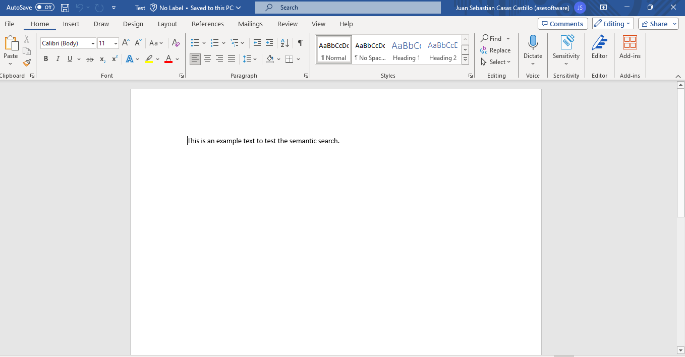
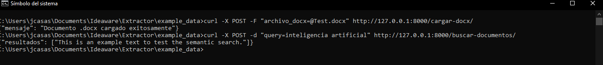
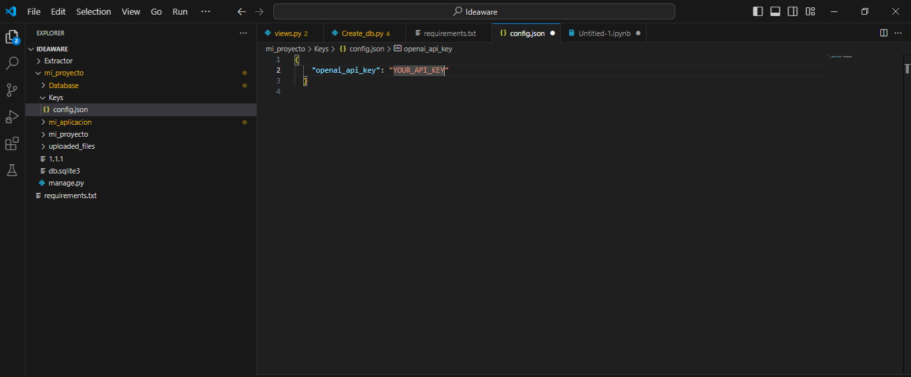

# Ideaware_test

Instrucciones de Ejecución del Sistema
Para ejecutar el sistema, sigue estos pasos:

1. Abre una terminal y navega hasta la carpeta Ideaware.
2. Crea un ambiente virtual con Conda o Virtualenv. Por ejemplo:

```
conda create --name mi_entorno_virtual python=3.10

```
3. Activa el ambiente virtual:
```
conda activate mi_entorno_virtual

```
4.Instala los paquetes necesarios utilizando pip:
```
pip install -r requirements.txt

```
5.Navega hasta la carpeta Ideaware/mi_proyecto.
6.Inicia el servicio ejecutando el siguiente comando:

```
python manage.py runserver

```

Una vez que el servicio esté en funcionamiento, podrás acceder a él y utilizar las funcionalidades proporcionadas por los endpoints REST.

# Enviando Solicitudes a los Endpoints
### Cargar Documento .docx:
Para cargar un documento .docx a través del endpoint correspondiente, sigue estos pasos:

1.Abre una terminal y navega hasta la ruta donde se encuentra el documento .docx que deseas cargar.

```
curl -X POST -F "archivo_docx=@Test.docx" http://127.0.0.1:8000/cargar-docx/

```

Este comando enviará el documento .docx al endpoint cargar-docx, donde será procesado y almacenado.

# Búsqueda de Documentos
Para buscar documentos utilizando el endpoint correspondiente, sigue estos pasos:

1. Abre una terminal.
2. Ejecuta el siguiente comando curl, reemplazando "inteligencia artificial" con la query deseada:
   
```
curl -X POST -d "query=inteligencia artificial" http://127.0.0.1:8000/buscar-documentos/

```
Este comando enviara una solicitud REST al endpoint y este respondera con el documento con mayor similaridad a la query.


### Ejemplo de uso:
* Se tiene un ambiente en conda llamado Idea y en este se instalaron los paquetes necesarios para correr el sistema (listados en requirments.txt)
* Se inicia el servicio corriendo:
  ```
  python manage.py runserver
  
  ```
1. En la terminal se ejecuta este comando:

```
curl -X POST -F "archivo_docx=@Test.docx" http://127.0.0.1:8000/cargar-docx/

```
Este comando sube el archivo Test.docx al endpoint. Este archvio se ve de esta manera: 



Seguidamente, se corren los siguientes comandos para subir el archvio el endpoint:

```
curl -X POST -F "archivo_docx=@Test.docx" http://127.0.0.1:8000/cargar-docx/

```

Y finalmente se corre el siguiente comando con la query deseada para obtener el documento con mayor coincidencia:
```
curl -X POST -d "query=inteligencia artificial" http://127.0.0.1:8000/buscar-documentos/

```
Esto devuelve el documento con mayor similaridad.

Esto se ve reflejado de esta manera en la terminal:

 

 ---
* Seguridad: Ya que el proyecto utiliza la API de OpenAI, es necesario contar con una API-KEY. En este caso, se añade la clave al archivo config.json ubicado en mi_proyecto\Keys\config.json. Esto permite colocar una sola API-KEY y no dejarla como una varible local en el codigo.

 
  
